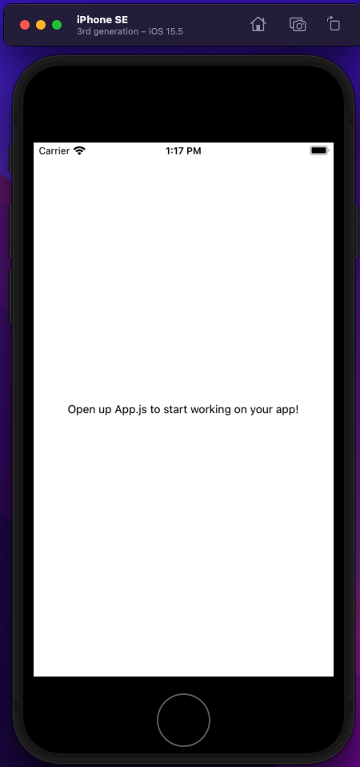

# ExpoApp
ReactNative学習用のリポジトリになります。

## アプリ起動コマンド

- cd TodoApp
- yarn start # you can open iOS, Android, or web from here, or run them directly with the commands below.
- yarn android
- yarn ios
- yarn web

うまく起動できれば下記のような内容がターミナルに出力される。

```terminal
arn run v1.22.17
warning ../../../package.json: No license field
$ expo start
Starting project at {path}/ExpoApp/TodoApp
Developer tools running on http://localhost:19002
Starting Metro Bundler
▄▄▄▄▄▄▄▄▄▄▄▄▄▄▄▄▄▄▄▄▄▄▄▄▄▄▄
█ ▄▄▄▄▄ █▄▄▄ ▀ ██ █ ▄▄▄▄▄ █
█ █   █ ██▄▀ █ ▀▄▄█ █   █ █
█ █▄▄▄█ ██▀▄ ▄ ██▀█ █▄▄▄█ █
█▄▄▄▄▄▄▄█ ▀▄█ ▀ ▀ █▄▄▄▄▄▄▄█
█▄ █ ▄▀▄▀█▄▀█▄██▀ █▄█▀█▀▀▄█
█ ▀█▄█▀▄  ▄██▄█ ▄▀▀███▄▀▀ █
█ ▄▄█▀▄▄ ▀▄ █▀█▄ █ ▄▀▀█▀ ██
█ ▄▀  ▀▄▄▄▄██▀▄█ ▄▀ ██▄▀  █
█▄█▄▄██▄▄ ▄  ▄▄ █ ▄▄▄  ▄▀▄█
█ ▄▄▄▄▄ ███▀▀▄  █ █▄█ ███ █
█ █   █ █ ▄ ▄ ██▄ ▄  ▄ █▀▀█
█ █▄▄▄█ █▀▀   █▄ ▄█▀▀▄█   █
█▄▄▄▄▄▄▄█▄▄█▄██▄▄▄▄█▄▄███▄█

› Metro waiting on exp://192.168.0.14:19000
› Scan the QR code above with Expo Go (Android) or the Camera app (iOS)

› Press a │ open Android
› Press i │ open iOS simulator
› Press w │ open web

› Press r │ reload app
› Press m │ toggle menu
› Press d │ show developer tools
› shift+d │ toggle auto opening developer tools on startup (disabled)

› Press ? │ show all commands

Logs for your project will appear below. Press Ctrl+C to exit.
Started Metro Bundler
› Opening on iOS...
› Opening exp://192.168.0.14:19000 on iPhone SE (3rd generation)
› Opening the iOS simulator, this might take a moment.
› Press ? │ show all commands
iOS Bundling complete 19280ms
iOS Bundling complete 25ms
```

## エミュレータ起動トラブル時

 <a href="https://www.ok-data.com/entry/xcode%E3%82%92%E3%82%A2%E3%83%83%E3%83%97%E3%83%87%E3%83%BC%E3%83%88%E3%81%97%E3%81%9F%E3%82%89expo%E3%81%A7ios%E3%82%B7%E3%83%9F%E3%83%A5%E3%83%AC%E3%83%BC%E3%82%BF%E3%81%8C%E8%B5%B7%E5%8B%95/">こちら</a>のサイトを参照のこと。

## 起動例

android

<br/>

iPhone



#### Overpass Turboのクエリで取得したデータ例

```xml
<?xml version="1.0" encoding="UTF-8"?>
<osm version="0.6" generator="Overpass API 0.7.58.5 b0c4acbb">
<note>The data included in this document is from www.openstreetmap.org. The data is made available under ODbL.</note>
<meta osm_base="2022-08-11T03:02:43Z"/>

  <node id="246574144" lat="41.8953181" lon="12.5031327">
    <tag k="amenity" v="drinking_water"/>
    <tag k="flow" v="constant"/>
    <tag k="fountain" v="nasone"/>
  </node>
  <node id="246574145" lat="41.8952417" lon="12.5030581">
    <tag k="amenity" v="drinking_water"/>
    <tag k="flow" v="constant"/>
    <tag k="fountain" v="nasone"/>
  </node>
  <node id="246574149" lat="41.8947855" lon="12.4919107">
    <tag k="amenity" v="drinking_water"/>
    <tag k="flow" v="push-button"/>
    <tag k="fountain" v="nasone"/>
  </node>
  <node id="246574150" lat="41.8948869" lon="12.4909457">
    <tag k="amenity" v="drinking_water"/>
    <tag k="check_date" v="2021-11-07"/>
  </node>
  <node id="246574151" lat="41.8944984" lon="12.4877390">
    <tag k="amenity" v="drinking_water"/>
  </node>
  <node id="246661215" lat="41.8975832" lon="12.5031998">
    <tag k="amenity" v="drinking_water"/>
    <tag k="fountain" v="nasone"/>
  </node>
  <node id="246661218" lat="41.8975679" lon="12.4902296">
    <tag k="amenity" v="drinking_water"/>
    <tag k="created_by" v="JOSM"/>
  </node>
  <node id="246661219" lat="41.8972914" lon="12.4977508">
    <tag k="amenity" v="drinking_water"/>
    <tag k="type" v="sculpture"/>
  </node>
  <node id="248743319" lat="41.8967142" lon="12.4859132">
    <tag k="amenity" v="drinking_water"/>
    <tag k="capacity" v="3"/>
    <tag k="fountain" v="nasone"/>
    <tag k="image" v="https://upload.wikimedia.org/wikipedia/commons/e/ed/Fontanella_delle_tre_cannelle.jpg"/>
    <tag k="name" v="Fontana delle tre cannelle"/>
    <tag k="wikidata" v="Q76938649"/>
  </node>
  <node id="248743322" lat="41.8960711" lon="12.4870349">
    <tag k="amenity" v="drinking_water"/>
    <tag k="wheelchair" v="limited"/>
  </node>
  <node id="248743324" lat="41.8935446" lon="12.4877253">
    <tag k="amenity" v="drinking_water"/>
    <tag k="check_date" v="2021-11-01"/>
  </node>
  <node id="250889642" lat="41.8959904" lon="12.4903891">
    <tag k="amenity" v="drinking_water"/>
    <tag k="fountain" v="nasone"/>
  </node>
  <node id="251773348" lat="41.8853910" lon="12.4852890">
    <tag k="amenity" v="drinking_water"/>
    <tag k="fountain" v="nasone"/>
  </node>
  <node id="251773349" lat="41.8870009" lon="12.4827727">
    <tag k="amenity" v="drinking_water"/>
    <tag k="fountain" v="nasone"/>
  </node>
  <node id="251792639" lat="41.8885804" lon="12.4836676">
    <tag k="amenity" v="drinking_water"/>
    <tag k="fountain" v="nasone"/>
    <tag k="image" v="File:Nasone via di San Teodoro, Roma, Italia Sep 08, 2021 06-03-56 PM.jpeg"/>
  </node>
  <node id="252441818" lat="41.8941782" lon="12.5038691">
    <tag k="amenity" v="drinking_water"/>
    <tag k="flow" v="constant"/>
    <tag k="fountain" v="nasone"/>
  </node>
  <node id="252441819" lat="41.8941232" lon="12.5039706">
    <tag k="amenity" v="drinking_water"/>
    <tag k="flow" v="constant"/>
    <tag k="fountain" v="nasone"/>
  </node>
  <node id="252602350" lat="41.8961224" lon="12.4929031">
    <tag k="amenity" v="drinking_water"/>
    <tag k="created_by" v="JOSM"/>
  </node>
  <node id="252609581" lat="41.8958602" lon="12.4969575">
    <tag k="amenity" v="drinking_water"/>
  </node>
  <node id="252899499" lat="41.8917675" lon="12.5022052">
    <tag k="amenity" v="drinking_water"/>
    <tag k="fountain" v="nasone"/>
    <tag k="image" v="File:Nasone Merulana, Roma, Italia Mar 22, 2022 04-53-33 PM.jpeg"/>
  </node>
  <node id="253704802" lat="41.8835007" lon="12.5030463">
    <tag k="amenity" v="drinking_water"/>
    <tag k="fountain" v="nasone"/>
    <tag k="tap" v="push_button"/>
  </node>
  <node id="256572272" lat="41.8947199" lon="12.4963709">
    <tag k="amenity" v="drinking_water"/>
    <tag k="fountain" v="nasone"/>
  </node>
  <node id="264897052" lat="41.8883122" lon="12.4809626">
    <tag k="amenity" v="drinking_water"/>
    <tag k="fountain" v="nasone"/>
  </node>
  <node id="265837380" lat="41.8865531" lon="12.5038415">
    <tag k="amenity" v="drinking_water"/>
    <tag k="check_date" v="2022-03-08"/>
    <tag k="fountain" v="nasone"/>
  </node>
  <node id="266310817" lat="41.8926848" lon="12.4931113">
    <tag k="amenity" v="drinking_water"/>
    <tag k="check_date" v="2021-11-01"/>
    <tag k="disused" v="yes"/>
  </node>
  <node id="266310881" lat="41.8923773" lon="12.4934985">
    <tag k="amenity" v="drinking_water"/>
  </node>
  <node id="266317282" lat="41.8932611" lon="12.4901658">
    <tag k="amenity" v="drinking_water"/>
  </node>
  <node id="266317940" lat="41.8913980" lon="12.4911918">
    <tag k="amenity" v="drinking_water"/>
    <tag k="check_date" v="2021-11-02"/>
  </node>
  <node id="266773743" lat="41.8825142" lon="12.4841127">
    <tag k="amenity" v="drinking_water"/>
    <tag k="fountain" v="nasone"/>
  </node>
  <node id="266773744" lat="41.8850606" lon="12.4803272">
    <tag k="amenity" v="drinking_water"/>
    <tag k="fountain" v="roman_travertine_block"/>
  </node>
  <node id="266965232" lat="41.8833501" lon="12.4875256">
    <tag k="amenity" v="drinking_water"/>
    <tag k="fountain" v="nasone"/>
    <tag k="image" v="File:Nasone, Viale Aventino, Roma, Italia Nov 04, 2020 09-28-54 AM.jpeg"/>
  </node>
  <node id="270198478" lat="41.8855249" lon="12.4943580">
    <tag k="amenity" v="drinking_water"/>
    <tag k="fountain" v="roman_wolf"/>
    <tag k="image" v="File:Roman wolf fountain, Parco del Celio, Roma, Italia Sep 01, 2020 12-32-47 PM.jpeg"/>
  </node>
  <node id="270198479" lat="41.8837598" lon="12.4947844">
    <tag k="amenity" v="drinking_water"/>
    <tag k="fountain" v="roman_wolf"/>
    <tag k="image" v="File:Roman Wolf Fountain, Villa Celimontana, Roma, Italia Sep 01, 2020 12-41-19 PM.jpeg"/>
  </node>
  <node id="270198480" lat="41.8854777" lon="12.4932314">
    <tag k="amenity" v="drinking_water"/>
    <tag k="fountain" v="roman_wolf"/>
    <tag k="image" v="File:Roman wolf fountain, Celio, Roma, Italia Sep 01, 2020 12-03-35 PM.jpeg"/>
  </node>
  <node id="280155143" lat="41.8894610" lon="12.5009036">
    <tag k="amenity" v="drinking_water"/>
  </node>
  <node id="281351519" lat="41.8963253" lon="12.4922226">
    <tag k="amenity" v="drinking_water"/>
  </node>
  <node id="281352641" lat="41.8915913" lon="12.5003989">
    <tag k="amenity" v="drinking_water"/>
    <tag k="fountain" v="nasone"/>
    <tag k="image" v="File:Nasone via botta, Roma, Italia Jun 30, 2022 06-23-28 PM.jpeg"/>
  </node>
  <node id="302112951" lat="41.8824822" lon="12.5028633">
    <tag k="amenity" v="drinking_water"/>
  </node>
  <node id="327114989" lat="41.8937726" lon="12.5010324">
    <tag k="amenity" v="drinking_water"/>
    <tag k="fountain" v="nasone"/>
  </node>
  <node id="388983995" lat="41.8869371" lon="12.4949446">
    <tag k="amenity" v="drinking_water"/>
  </node>
  <node id="388984003" lat="41.8877413" lon="12.4945190">
    <tag k="amenity" v="drinking_water"/>
    <tag k="fountain" v="nasone"/>
  </node>
  <node id="469752582" lat="41.8903641" lon="12.5029448">
    <tag k="amenity" v="drinking_water"/>
    <tag k="fountain" v="nasone"/>
  </node>
  <node id="495113034" lat="41.8913309" lon="12.4934283">
    <tag k="amenity" v="drinking_water"/>
    <tag k="check_date" v="2022-06-22"/>
  </node>
  <node id="497353710" lat="41.8844827" lon="12.4801727">
    <tag k="amenity" v="drinking_water"/>
  </node>
  <node id="551785500" lat="41.8829156" lon="12.4997696">
    <tag k="amenity" v="drinking_water"/>
    <tag k="fountain" v="nasone"/>
  </node>
  <node id="685457655" lat="41.8902623" lon="12.4867108">
    <tag k="amenity" v="drinking_water"/>
    <tag k="check_date" v="2021-11-01"/>
  </node>
  <node id="685461877" lat="41.8891234" lon="12.4875779">
    <tag k="amenity" v="drinking_water"/>
    <tag k="check_date" v="2021-11-01"/>
  </node>
  <node id="685465032" lat="41.8829819" lon="12.4915911">
    <tag k="amenity" v="drinking_water"/>
    <tag k="fountain" v="nasone"/>
    <tag k="image" v="File:Nasone, Viale delle Terme di Caracalla, Roma, Italia Sep 01, 2020 10-57-05 AM.jpeg"/>
  </node>
  <node id="953890053" lat="41.8887986" lon="12.4879526">
    <tag k="amenity" v="drinking_water"/>
  </node>
  <node id="953890062" lat="41.8909850" lon="12.4883755">
    <tag k="amenity" v="drinking_water"/>
    <tag k="check_date" v="2021-11-01"/>
  </node>
  <node id="953909059" lat="41.8889852" lon="12.4968765">
    <tag k="amenity" v="drinking_water"/>
    <tag k="fountain" v="nasone"/>
    <tag k="image" v="File:Nasone via dei santi Quattro,roma,italy 62022.jpeg"/>
  </node>
  <node id="1157932638" lat="41.8867552" lon="12.4954695">
    <tag k="amenity" v="drinking_water"/>
    <tag k="fountain" v="nasone"/>
  </node>
  <node id="1170494282" lat="41.8900377" lon="12.4942213">
    <tag k="amenity" v="drinking_water"/>
    <tag k="fountain" v="nasone"/>
  </node>
  <node id="1407542660" lat="41.8952361" lon="12.4919666">
    <tag k="amenity" v="drinking_water"/>
    <tag k="fountain" v="nasone"/>
  </node>
  <node id="1656861982" lat="41.8907173" lon="12.4883955">
    <tag k="amenity" v="drinking_water"/>
    <tag k="check_date" v="2021-11-01"/>
  </node>
  <node id="1701226235" lat="41.8890191" lon="12.5019658">
    <tag k="amenity" v="drinking_water"/>
  </node>
  <node id="1709280191" lat="41.8913190" lon="12.4911794">
    <tag k="amenity" v="drinking_water"/>
    <tag k="check_date" v="2021-11-02"/>
    <tag k="name:ru" v="вода с газом и без. бесплатная"/>
  </node>
  <node id="2105948243" lat="41.8968428" lon="12.4878685">
    <tag k="amenity" v="drinking_water"/>
  </node>
  <node id="2537299968" lat="41.8911676" lon="12.4987211">
    <tag k="amenity" v="drinking_water"/>
    <tag k="fountain" v="nasone"/>
    <tag k="image" v="File:Nasone via mecenate, Roma, Italia Jun 30, 2022 06-19-16 PM.jpeg"/>
    <tag k="indoor" v="no"/>
  </node>
  <node id="2724305949" lat="41.8877205" lon="12.5020523">
    <tag k="amenity" v="drinking_water"/>
    <tag k="fountain" v="nasone"/>
  </node>
  <node id="3056141350" lat="41.8911658" lon="12.4821627">
    <tag k="amenity" v="drinking_water"/>
    <tag k="fountain" v="nasone"/>
    <tag k="image" v="File:Nasone Piazza della Consolazione, Roma, Italia Sep 08, 2021 06-22-13 PM.jpeg"/>
  </node>
  <node id="3098527533" lat="41.8915162" lon="12.4841145">
    <tag k="amenity" v="drinking_water"/>
    <tag k="fountain" v="nasone"/>
  </node>
  <node id="3785014818" lat="41.8873381" lon="12.4934389">
    <tag k="amenity" v="drinking_water"/>
  </node>
  <node id="3786621294" lat="41.8867114" lon="12.4927208">
    <tag k="amenity" v="drinking_water"/>
  </node>
  <node id="5167443540" lat="41.8955726" lon="12.4931902">
    <tag k="access" v="yes"/>
    <tag k="amenity" v="drinking_water"/>
    <tag k="covered" v="no"/>
    <tag k="fee" v="no"/>
    <tag k="fountain" v="nasone"/>
  </node>
  <node id="5314059440" lat="41.8863528" lon="12.4901240">
    <tag k="amenity" v="drinking_water"/>
    <tag k="fountain" v="nasone"/>
    <tag k="image" v="File:Nasone piazza di San Gregorio, Roma, Italia Sep 01, 2020 11-51-42 AM.jpeg"/>
  </node>
  <node id="5340247517" lat="41.8912427" lon="12.4978518">
    <tag k="amenity" v="drinking_water"/>
    <tag k="fountain" v="drinking"/>
    <tag k="image" v="File:Drinking fountain, Parco del Colle Oppio, Roma, Italia Jun 30, 2022 07-51-16 PM.jpeg"/>
    <tag k="note" v="not a nasone, historic drinking fountain"/>
  </node>
  <node id="5340252322" lat="41.8913872" lon="12.4973968">
    <tag k="amenity" v="drinking_water"/>
    <tag k="fountain" v="drinking"/>
    <tag k="image" v="File:Drinking fountain, Parco del Colle Oppio, Roma, Italia Jun 30, 2022 07-49-50 PM.jpeg"/>
    <tag k="note" v="not a nasone, historic drinking fountain"/>
  </node>
  <node id="5535092255" lat="41.8918027" lon="12.4915049">
    <tag k="amenity" v="drinking_water"/>
  </node>
  <node id="5732659653" lat="41.8936702" lon="12.4923174">
    <tag k="amenity" v="drinking_water"/>
  </node>
  <node id="5767727022" lat="41.8921044" lon="12.4858406">
    <tag k="amenity" v="drinking_water"/>
  </node>
  <node id="5801329944" lat="41.8881076" lon="12.4885132">
    <tag k="amenity" v="drinking_water"/>
    <tag k="description:de" v="Wasserbrunnen"/>
  </node>
  <node id="5842514639" lat="41.8922247" lon="12.4823087">
    <tag k="amenity" v="drinking_water"/>
    <tag k="fountain" v="roman_wolf"/>
    <tag k="image" v="File:Fountain, Foro Romano, Roma, Italia Mar 15, 2022 10-52-31 PM.jpeg"/>
  </node>
  <node id="6280605307" lat="41.8939824" lon="12.4936946">
    <tag k="amenity" v="drinking_water"/>
    <tag k="level" v="1"/>
  </node>
  <node id="6547153465" lat="41.8971021" lon="12.4941377">
    <tag k="amenity" v="drinking_water"/>
  </node>
  <node id="6547164641" lat="41.8923303" lon="12.4870090">
    <tag k="amenity" v="drinking_water"/>
  </node>
  <node id="6616168986" lat="41.8922741" lon="12.4967144">
    <tag k="amenity" v="drinking_water"/>
  </node>
  <node id="6677290730" lat="41.8957857" lon="12.5014932">
    <tag k="amenity" v="drinking_water"/>
  </node>
  <node id="6841124063" lat="41.8906387" lon="12.4926345">
    <tag k="amenity" v="drinking_water"/>
  </node>
  <node id="7085935353" lat="41.8915996" lon="12.4941883">
    <tag k="access" v="yes"/>
    <tag k="amenity" v="drinking_water"/>
    <tag k="fee" v="no"/>
  </node>
  <node id="7203154248" lat="41.8882028" lon="12.4955486">
    <tag k="amenity" v="drinking_water"/>
    <tag k="fountain" v="nasone"/>
    <tag k="image" v="File:Nasone Via Marco Aurelio, Roma, Italia Jun 30, 2022 08-08-32 PM.jpeg"/>
  </node>
  <node id="7869827179" lat="41.8966257" lon="12.4947587">
    <tag k="amenity" v="drinking_water"/>
  </node>
  <node id="8845683381" lat="41.8933246" lon="12.4838530">
    <tag k="amenity" v="drinking_water"/>
  </node>
  <node id="9108120217" lat="41.8877336" lon="12.4847106">
    <tag k="amenity" v="drinking_water"/>
    <tag k="name" v="Acqua"/>
    <tag k="name:en" v="Drinkable water"/>
    <tag k="name:fr" v="Eau potable"/>
  </node>
  <node id="9878433809" lat="41.8931080" lon="12.4970398">
    <tag k="amenity" v="drinking_water"/>
  </node>
  <node id="9909473217" lat="41.8850881" lon="12.4803800">
    <tag k="amenity" v="drinking_water"/>
  </node>

</osm>
```

### トイレ情報を取得するクエリ例

```
(
node
  [amenity=toilets]
  ({{bbox}});
node 
  ["toilets:wheelchair"=yes]
  ({{bbox}});
 );
out;
```

#### ReactNative CLIでプロジェクトを作成する場合

`react-native init {project name}`

出力結果例
```cmd
                                                          
               ######                ######               
             ###     ####        ####     ###             
            ##          ###    ###          ##            
            ##             ####             ##            
            ##             ####             ##            
            ##           ##    ##           ##            
            ##         ###      ###         ##            
             ##  ########################  ##             
          ######    ###            ###    ######          
      ###     ##    ##              ##    ##     ###      
   ###         ## ###      ####      ### ##         ###   
  ##           ####      ########      ####           ##  
 ##             ###     ##########     ###             ## 
  ##           ####      ########      ####           ##  
   ###         ## ###      ####      ### ##         ###   
      ###     ##    ##              ##    ##     ###      
          ######    ###            ###    ######          
             ##  ########################  ##             
            ##         ###      ###         ##            
            ##           ##    ##           ##            
            ##             ####             ##            
            ##             ####             ##            
            ##          ###    ###          ##            
             ###     ####        ####     ###             
               ######                ######               
                                                          

                  Welcome to React Native!                
                 Learn once, write anywhere               

✔ Downloading template
✔ Copying template
✔ Processing template
✔ Installing CocoaPods dependencies (this may take a few minutes)

  
  Run instructions for Android:
    • Have an Android emulator running (quickest way to get started), or a device connected.
    • cd "/Users/harukikondo/git/ExpoApp/BarcodeReader" && npx react-native run-android
  
  Run instructions for iOS:
    • cd "/Users/harukikondo/git/ExpoApp/BarcodeReader" && npx react-native run-ios
    - or -
    • Open BarcodeReader/ios/BarcodeReader.xcworkspace in Xcode or run "xed -b ios"
    • Hit the Run button
    
  Run instructions for macOS:
    • See https://aka.ms/ReactNativeGuideMacOS for the latest up-to-date instructions.
    
  
(base) harukikondo@kondouharuakiranoiMac ExpoApp % npm i -g near-cli
npm WARN config global `--global`, `--local` are deprecated. Use `--location=global` instead.
npm WARN deprecated @ledgerhq/hw-transport-u2f@5.36.0-deprecated: @ledgerhq/hw-transport-u2f is deprecated. Please use @ledgerhq/hw-transport-webusb or @ledgerhq/hw-transport-webhid. https://github.com/LedgerHQ/ledgerjs/blob/master/docs/migrate_webusb.md

added 321 packages, and audited 322 packages in 30s

27 packages are looking for funding
  run `npm fund` for details

4 moderate severity vulnerabilities

To address all issues (including breaking changes), run:
  npm audit fix --force

Run `npm audit` for details.
```

### nativeモジュールをアプリで使えるようにするためのコマンド
 `react-native link {モジュール名}`

### 参考文献
 1. [トイレマップアプリ](https://github.com/mashharuki/MBToiletMap)
 2. [Expoの公式ドキュメント](https://docs.expo.dev/get-started/create-a-new-app/)
 3. [Overpass API 公式ドキュメント](http://overpass-api.de/)
 4. [Overpass Turbo](https://overpass-turbo.eu/)
 5. [turf.jsの公式ドキュメント](https://turfjs.org/)
 6. [ReactNativeCameraのGitHubリポジトリ](https://github.com/react-native-camera/react-native-camera)
 7. [ReactNativeCameraの公式サイト](https://react-native-camera.github.io/react-native-camera/)
