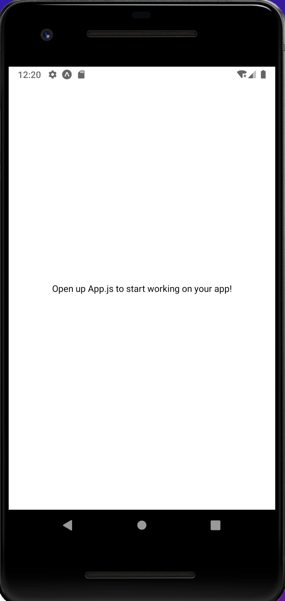

# ExpoApp
ReactNative学習用のリポジトリになります。

## アプリ起動コマンド

- cd TodoApp
- yarn start # you can open iOS, Android, or web from here, or run them directly with the commands below.
- yarn android
- yarn ios
- yarn web

うまく起動できれば下記のような内容がターミナルに出力される。

```terminal
arn run v1.22.17
warning ../../../package.json: No license field
$ expo start
Starting project at {path}/ExpoApp/TodoApp
Developer tools running on http://localhost:19002
Starting Metro Bundler
▄▄▄▄▄▄▄▄▄▄▄▄▄▄▄▄▄▄▄▄▄▄▄▄▄▄▄
█ ▄▄▄▄▄ █▄▄▄ ▀ ██ █ ▄▄▄▄▄ █
█ █   █ ██▄▀ █ ▀▄▄█ █   █ █
█ █▄▄▄█ ██▀▄ ▄ ██▀█ █▄▄▄█ █
█▄▄▄▄▄▄▄█ ▀▄█ ▀ ▀ █▄▄▄▄▄▄▄█
█▄ █ ▄▀▄▀█▄▀█▄██▀ █▄█▀█▀▀▄█
█ ▀█▄█▀▄  ▄██▄█ ▄▀▀███▄▀▀ █
█ ▄▄█▀▄▄ ▀▄ █▀█▄ █ ▄▀▀█▀ ██
█ ▄▀  ▀▄▄▄▄██▀▄█ ▄▀ ██▄▀  █
█▄█▄▄██▄▄ ▄  ▄▄ █ ▄▄▄  ▄▀▄█
█ ▄▄▄▄▄ ███▀▀▄  █ █▄█ ███ █
█ █   █ █ ▄ ▄ ██▄ ▄  ▄ █▀▀█
█ █▄▄▄█ █▀▀   █▄ ▄█▀▀▄█   █
█▄▄▄▄▄▄▄█▄▄█▄██▄▄▄▄█▄▄███▄█

› Metro waiting on exp://192.168.0.14:19000
› Scan the QR code above with Expo Go (Android) or the Camera app (iOS)

› Press a │ open Android
› Press i │ open iOS simulator
› Press w │ open web

› Press r │ reload app
› Press m │ toggle menu
› Press d │ show developer tools
› shift+d │ toggle auto opening developer tools on startup (disabled)

› Press ? │ show all commands

Logs for your project will appear below. Press Ctrl+C to exit.
Started Metro Bundler
› Opening on iOS...
› Opening exp://192.168.0.14:19000 on iPhone SE (3rd generation)
› Opening the iOS simulator, this might take a moment.
› Press ? │ show all commands
iOS Bundling complete 19280ms
iOS Bundling complete 25ms
```

## エミュレータ起動トラブル時

 <a href="https://www.ok-data.com/entry/xcode%E3%82%92%E3%82%A2%E3%83%83%E3%83%97%E3%83%87%E3%83%BC%E3%83%88%E3%81%97%E3%81%9F%E3%82%89expo%E3%81%A7ios%E3%82%B7%E3%83%9F%E3%83%A5%E3%83%AC%E3%83%BC%E3%82%BF%E3%81%8C%E8%B5%B7%E5%8B%95/">こちら</a>のサイトを参照のこと。

## 起動例

android

<br/>

iPhone

